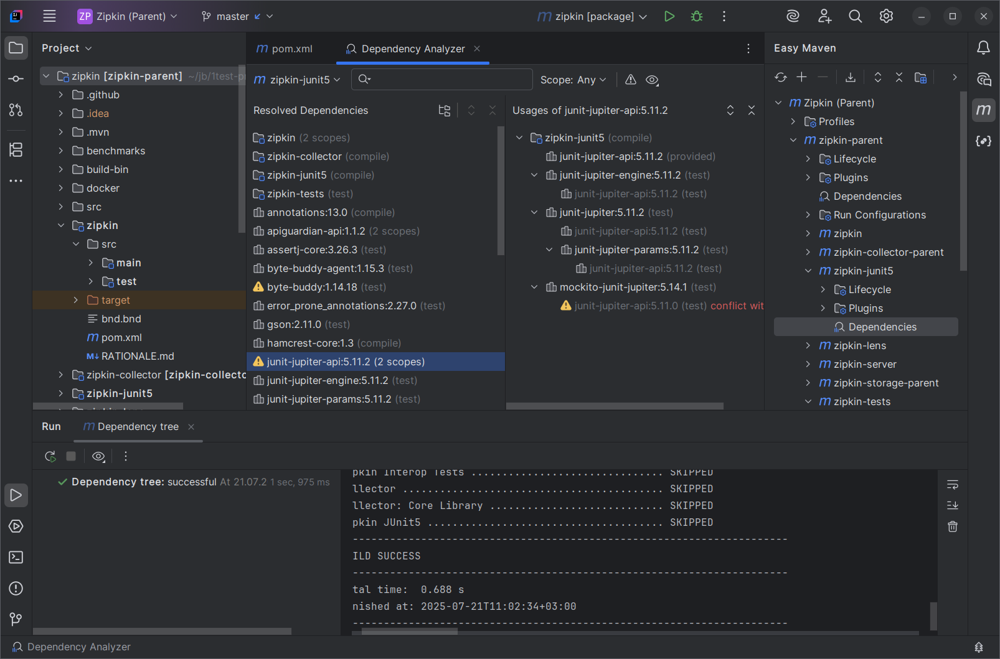
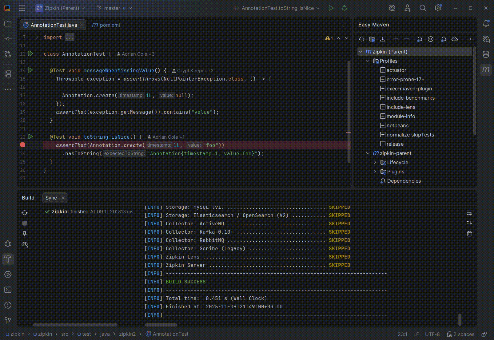

Easy Maven (Old name: GMaven). IntelliJ Plugin [page](https://plugins.jetbrains.com/plugin/22370-easy-maven)
==================

The lightweight Maven plugin that gets the project model through maven task execution.
This provides greater simplicity and original build tool behavior in obtaining project data.

### Maven Plugin for IntelliJ IDEA [GitHub-Wiki](https://github.com/grisha9/gmaven-plugin/wiki)

The plugin adds support for the Maven for Java language projects:

- Original Maven behavior for importing project model into IDEA
- Run Task & Debug test via Maven
- Dependency analyzer
- Maven 4 support
- Groovy support
- Kotlin JVM support

  

#### Articles about Easy Maven

- [dev.to](https://dev.to/grisha9/my-intellij-idea-plugin-for-maven-support-gmaven-cn9);
- [habr1.com](https://habr.com/ru/articles/753828/) (Russian);
- [habr2.com](https://habr.com/ru/articles/882778/) (Russian);
- [habr3.com](https://habr.com/ru/articles/969386/) (Russian);

### Prerequisites

1. IntelliJ IDEA 2021.3+
2. Maven 3.3.1+
3. Access to [Maven Central](https://mvnrepository.com/artifact/io.github.grisha9/maven-model-reader-plugin)
   for [model-reader-plugin](https://github.com/grisha9/maven-model-reader)

### Issues

If you found a bug, please report it on https://github.com/grisha9/easy-maven-plugin/issues

Wiki about issues: https://github.com/grisha9/easy-maven-plugin/wiki/Issues

